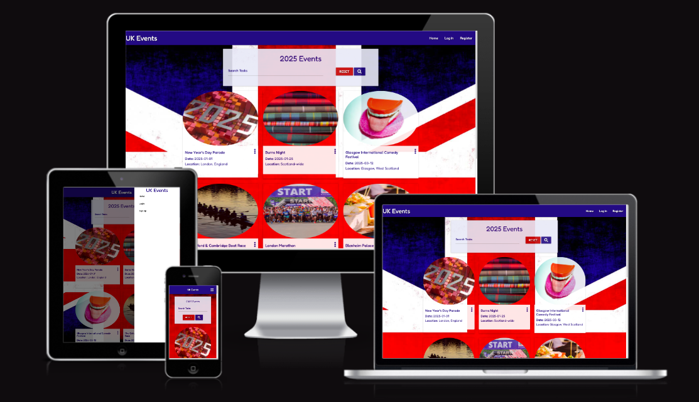

# UK Events

[View UK Events Website](https://uk-events-list-ecfed9ff9bb9.herokuapp.com/)

___

## CONTENTS
* [Rationale](#rationale)
  * [Project Introduction](#project-introduction)
  * [Motivation and Inspiration](#motivation-and-inspiration)
  * [Project Scope and Limitations](#project-scope-and-limitations)

* [User Experience](#user-experience-ux)
  * [Site Goals](#site-goals)
  * [User Stories](#user-stories)

* [Design](#design)
  * [Colour Scheme](#colour-scheme)
  * [Typography](#typography)
  * [Imagery](#imagery)
  * [Wireframes](#wireframes)
  * [Database Structure](#database-structure)

* [Features](#features)
  * [General Features on Each Page](#general-features-on-each-page)
  * [Future Implementations](#future-implementations)
  * [Accessibility](#accessibility)

* [Technologies Used](#technologies-used)
  * [Languages Used](#languages-used)
  * [Frameworks, Libraries & Programs Used](#frameworks-libraries--programs-used)

* [Deployment & Local Development](#deployment--local-development)
  * [Deployment](#deployment)
  * [Local Development](#local-development)
    * [How to Fork](#how-to-fork)
    * [How to Clone](#how-to-clone)
  * [Creating an App with the Heroku](#creating-an-app-with-the-heroku)

* [Testing](#testing)
  * [W3C Validator](#w3c-validator)
  * [Solved Bugs](#solved-bugs)
  * [Testing User Stories](#testing-user-stories)
  * [Performance Testing](#performance-testing)
  * [Further Testing](#further-testing)
  * [Manual Testing](#manual-testing)

* [Credits](#credits)
  * [Code Used](#code-used)
  * [Tutorials](#tutorials)
  * [Background Image](#background-image)
  * [Quiz Questions](#quiz-questions)
  * [Acknowledgments](#acknowledgments)

  ---
## Rationale

### Project Introduction
An opportunity to bring together events from across the UK to one place, allowing you to be able to check upcoming events in 2025. You will also be able to register/login to your account, where you can add, edit and delete their own events.

### Motivation and Inspiration
Events are happening every day through out the UK and indeed the World. Whether these are National events, sporting events, to Festivals of all sizes. This website gives the opportunity to bring these all together as an easy point of reference to check details or location of the event.

The inspiration for creating this website is to produce an Event log that is accessible to all, that may encourage and introduce users to become attendees to new events around the UK and help educate users on different events going on around the UK.

### Project Scope and Limitations
The scope of the project includes the creation of an Event database with the features focusing on usability on mulitple devices and accessbility for anyone wanting to go to UK Events.

The known limitation is the UK Events website currently just forcuses on next year (2025) and is UK based. To solve this limitation I would expand to other future years with a section for past events and potentially expand to add different locations Worldwide.

## User Experience (UX)

### Site Goals
* I want the user to be able to view the site on a range of device sizes.
* I want the site to be attractive, responsive and easy to use for the user.
* I want the site to work as up-to-date reference point for UK Events.
* I want the user to be educated on Events that they may not know about.
* I want the site to be user friendly and for all ages.

### User Stories

#### First Time Visitor Goals

* I want to be able view events.
* I want to be able to navigate the site easily to find information.
* I want to be able to find their social media pages.
* I want the website to be responsive to whichever device I am using.
* I want to be able to register to add my own events.

#### Returning/Frequent Visitor Goals

* I want to be able to log in to my account.
* I want to be able to introduce more users to my events coming up to increase attendances.
* I want to be able to edit my own events.
* I want to be able to delete my own events.

## Design

### Colour Scheme

The website uses a palette of blues and reds to depict the Union Jack flag. The colour palette was created using the [Coolors](https://coolors.co/) website.

### Typography

I have used Fredoka from Google Fonts for this website. I like the round font and I felt it added a little fun to the text. It is a Sans Serif font.

### Imagery

The background image has been picked for it's patriotic look. I have credited this at the end.

### Wireframes

Wireframes were created for mobile, tablet and desktop.

### Database Structure

[DB Diagram](https://dbdiagram.io/d) was used to creat my database structure.

#### Database Schema

I first created a database structure and from this I decide to use a non relational database for this project and used a schemaless database called MongoDB. So I first created the database and added three collections for each table in my database structure.

#### Database tables

The first table is categories to group all the different events in to key categories to separate them. 

The second table holds the users for the website and their passwords to allow login.

The third table has the information for each event. It hold 9 fields that comprise of _Id, category_name, event_name, event_details, location, date, link, image and created_by. 

## Features

The website is comprised of:
1. Home Events page
    * Shows the events.

    

    

    

    * Has a Search feature.

    

    * Can only edit/delete reviews as admin or the creator of the event.

    

    
    
2. Register page
    * Allows the user to register.
    * If already registered it sends them to the login page.

    

3. Login page
    * Allows the user to login.
    * If not registered it sends them to the register page.

    

4. New event page
    * For users to add new events.

    

5. Edit event page
    * For users to edit events.

    

6. Manage Categories page
    * For admin to view categories.

    

7. Edit Category page
    * For admin to edit category.

    

8. New Category page
    * For admin to create new category.

    

9. 404.html
    * Redirects the user back to events.html to prevent them having to press the browser back button for better experience.

    

### General features on each page

All Pages on the website are responsive and have:

* A favicon in the browser tab.

* All Pages on the website have:
  * Logo

    

  * To the right of the navigation bar are the links to the websites pages. 

    

    or collapsed for tablets and mobiles.

    

    

  * In the middle is the Title.

    

  * Flash messages on all pages for different messages.

    

  * A footer which contains social media icon links to Facebook, Instagram and Twitter. 

    
  
### Future Implementations

* Add next 5 years.

* Store past events for reference.

### Accessibility

 * I have made sure there is colour contrast on the site. 
 
 * I have used a hover state on all buttons on the site to make it clear to the user if they are hovering over a button.

## Technologies Used

### Languages Used

* HTML, CSS and JavaScript were used to create this website.

### Frameworks, Libraries & Programs Used

* [Balsamiq](https://balsamiq.com/) - Used to create wireframes.

* [Git](https://git-scm.com/) - For version control.

* [Github](https://github.com/) - To save and store the files for the website.

* [GitPod](https://gitpod.io/) - IDE used to create the site.

* [Google Fonts](https://fonts.google.com/) - To import the fonts used on the website.

* [Heroku](https://id.heroku.com/login) - Hosting Website

* [jQuery](https://jquery.com/) - A JavaScript library.

* [Google Developer Tools](https://developers.google.com/web/tools) - To troubleshoot and test features, solve issues with responsiveness and styling.

* [Materialize](https://materializecss.com/) - A modern responsive front-end framework based on Material Design

* [TinyPNG](https://tinypng.com/) To compress image.

* [Image Resizer](https://imageresizer.com/) To resize image.

* [Favicon.io](https://favicon.io/) To create favicon.

* [Am I Responsive?](http://ami.responsivedesign.is/) To show the website image on a range of devices.

* [Webpage Spell-Check](https://chrome.google.com/webstore/detail/webpage-spell-check/mgdhaoimpabdhmacaclbbjddhngchjik/related) - a google chrome extension that allows you to spell check your webpage. Used to check the site and the readme for spelling errors.

## Deployment & Local Development

### Deployment 

Github Pages was used to deploy the live website. The instructions to achieve this are below:

1. Log in to Github.
2. Find the repository for this project, uk_event_list.
3. Click on the Settings button.
4. Click on the Pages button in the left hand side bar.
5. In the Source section, choose main from the drop down select branch menu. Select Root from the drop down select folder menu.
6. Click Save. Your live Github Pages site is now deployed at the URL shown.

### Local Development

The local development section gives instructions on how someone else could make a copy of your project to play with on their local machine. This section will get more complex in the later projects, and can be a great reference to yourself if you forget how to do this.

#### How to Fork

To fork classicalmusicquiz repository:

1. Log in to Github.
2. Go to the repository for this project, CharlieBurton10/uk_event_list
3. Click the Fork button at the top of the page between Watch and Starred.

#### How to Clone

To clone uk_event_list repository:

1. Log in to Github.
2. Go to the repository for this project, CharlieBurton10/uk_event_list
3. Click on the code button, select whether you would like to clone with HTTPS, SSH or GitHub CLI and copy the link shown.
4. Open the terminal in your code editor and change the current working directory to the location you want to use for the cloned directory.
5. Type 'git clone' into the terminal and then enter.
6. Then paste link from step 3 ($ git clone https://github.com/CharlieBurton10/uk_event_list) and then press enter.

### Creating an App with the Heroku :

1. Navigate to [Heroku.com](https://www.heroku.com/).
2. Create a new account or login.
3. Click the **new** button, then **create new app** button.
4. Choose your app name and the region and click **create app**.

#### Connecting your Heroku account to your Github repository :

1. In your app choose **Deploy** tab and choose *Github* as your deployment method. 
2. Enter the GitHub repository name and click on *Search*.
3. Once the correct repository is found, click on *Connect*.

#### Setting you enviroment variables  :

1. Navigate to **Settings** tab and click on *Reveal Config Vars* and set following variables :

- DATABASE_URL : URL to your databse
- DEBUG : Can be set to true but **ONLY** during development. It's extremely important to change it to false once development process is over.
- IP : 0.0.0.0
- PORT : 5000
- SECRET_KEY : Your custom secret key.

**PLEASE NOTE THAT YOU SHOULD NEVER SHARE ABOVE DETAILS WITH ANYONE DUE TO THE SECURITY REASONS!**

**IMPORTANT** *In order to successfully deploy your project to Heroku, you must include requirements.txt and Procfile files.* 

The following commands in the Gitpod CLI will create the relevant files :

`pip3 freeze --local > requirements.txt`

`echo web: python app.py > Procfile`

## Testing

Testing has been on going throughout the build with Chrome developer tools.

### W3C Validator

The W3C validator was used to validate the HTML on all pages of the website. It was also used to validate CSS in the style.css file.

[Home Page HTML](docs/testing/w3chome.png) - Passed

[Login Page HTML](docs/testing/w3clogin.pgn) - Passed

[Register Page HTML](docs/testing/w3cregister.pgn) - Passed

[Profile Page HTML](docs/testing/w3cprofile.pgn) - 

[New Event Page HTML](docs/testing/w3cnew_event.pgn) - Passed

[Edit Event Page HTML](docs/testing/w3cnew_event.pgn) - 3 errors with 'No space between attributes'. This has no been resolved with spaces being added.

[Manage Categories Page HTML](docs/testing/w3cget_catergories.png) - Passed

[New Category Page HTML](docs/testing/w3cgnew_catergory.png) - Passed

[Edit Category Page HTML](docs/testing/w3cget_catergory.png) - Passed

[404 Page HTML](docs/testing/w3c404.png) - 

[CSS](docs/testing/w3ccss.png) - Passed

[JQuery Validator](docs/testing/jqueryvalidator.png) - JQuery is valid

[app.py](docs/testing/app_py.png): No errors were returned when passing through CI Python Linter

### Testing User Stories

#### First Time Visitor Goals

* I want to be able view events.
  * The home page shows the event cards that have been added.

  

* I want to be able to navigate the site easily to find information.
  * All site navigation is in the top right corner on every page of the website.

  

* I want to be able to find their social media pages.
  * In the footer on every page sits links to the social media pages.

  

* I want the website to be responsive to whichever device I am using.
  * I have checked that the website is responsive on multiple devices.

* I want to be able to register to add my own events.
  * The user can register and then add their own event.

  

  

#### Returning/Frequent Visitor Goals

* I want to be able to log in to my account.
  * I have added a log in page so returning visitors can log back in.

  

* I want to be able to introduce more users to my events coming up to increase attendance.
  * In the footer on every page sits links to the social media pages to spread the website and events on the website to increase attendance.

  

* I want to be able to edit my own events.
  * I have added on each event card an edit button thats sends them to an edit page.

  

  
  
* I want to be able to delete my own events.
  * I have added on each event card a delete button thats sends them to a delete modal before deleting.

  

  

### Performance Testing

[Google Lighthouse](https://developers.google.com/web/tools/lighthouse/) was used to measure the performance and speed of the website. 

|     Page      |     Mobile    |    Desktop    |
| ------------  | ------------- | ------------- |
|  events.html  |    [Result](docs/testing/lighthouse/eventsmobile.png)   |    [Result](docs/testing/lighthouse/eventsdesktop.png)  | 
|  login.html    |    [Result](docs/testing/lighthouse/loginmobile.png)    |    [Result](docs/testing/lighthouse/logindesktop.png)   | 
|  register.html     |    [Result](docs/testing/lighthouse/registermobile.png)     |    [Result](docs/testing/lighthouse/registerdesktop.png)    |  
|  profile.html |    [Result](docs/testing/lighthouse/profilemobile.png) |    [Result](docs/testing/lighthouse/profiledesktop.png)  | 
|  categories.html |    [Result](docs/testing/lighthouse/categoriesmobile.png) |    [Result](docs/testing/lighthouse/categoriesdesktop.png)  | 
|  new_event.html |    [Result](docs/testing/lighthouse/new_eventmobile.png) |    [Result](docs/testing/lighthouse/new_eventdesktop.png)  | 
|  edit_event.html |    [Result](docs/testing/lighthouse/edit_eventmobile.png) |    [Result](docs/testing/lighthouse/edit_eventdesktop.png)  | 
|  new_category.html |    [Result](docs/testing/lighthouse/new_categorymobile.png) |    [Result](docs/testing/lighthouse/new_categorydesktop.png)  | 
|  edit_category.html |    [Result](docs/testing/lighthouse/edit_categorymobile.png) |    [Result](docs/testing/lighthouse/edit_categorydesktop.png)  | 

### Further Testing

 * The website was tested on Google Chrome, Safari and Microsoft Edge browsers.
 * The website was tested on multiple devices: Desktop, Mackbook 14inch, iPad Pro and iPhone 14.
 * All browsers and devices were tested on all pages to make sure all the pages and links are working properly.

 ### Manual Testing

#### All pages
Feature | Expected Outcome	| Testing Performed |	Result	| Pass/Fail |
| --- | --- | --- | --- | --- |
| Nav links:hover | Background colour when links are hovered | Hovered over each header link | Colour changed | Pass |
| Nav links| Launches / Resets Nav Links| Clicked the Nav Links| Links clicked and correct pages launched | Pass |
| Social Media links| Text change colour when links are hovered | Hovered over each header link | Colour changed | Pass |

#### events.html
Feature | Expected Outcome	| Testing Performed |	Result	| Pass/Fail |
| --- | --- | --- | --- | --- |
| "Reset" Button | Resets the search text bar | Entered text to search bar and then clicked "Reset" button | Search bar clears | Pass | 
| "Search" Button | Launches the search | Entered text to the search bar and clicked "Search" button | Search results appear on the page | Pass | 
| Answers:hover | Background change colour when the mouse hovers | Hovered over any answer | Colour changed | Pass |
| Answers:clicked | Background change colour when clicked | Clicked any answer | Colour changed green for correct answer and red for wrong answer  | Pass |
| Answers:clicked | New question appears| Clicked an answer | Next question appeared | Pass |
| Timer alert | Timer alert when timer runs out | Let the timer run out | Alert boxed launched with "OK" button | Pass |
| "OK" alert button | Resets quiz | Clicked "OK" button | Reset quiz | Pass |
| 5 questions answered | end.html launched with final score | Completed quiz answering 5 questions | end.html appeared | Pass
